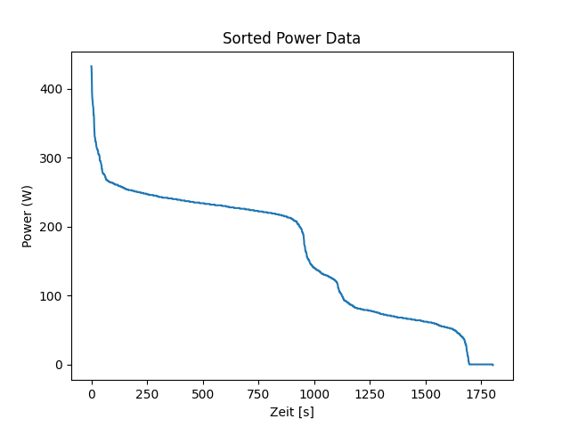

# PUE_GruppeA

Das ist das Projekt für die Abgabe Aufgabe 1 für Programmierübung 2

# Beschreibung
Die Datei `load_data.py`liest die Daten aus der Datei `activity.csv` ein. Die Daten werden dann über einen bubble-Sort Algorithmus sortiert, welcher in der Datei `sort.py`erstellt wurde. Die Datei `power_curve.py`import dann die sortierten Daten aus der `load_data.py` Datei, plottete diese über matplotlib und speichert diese dann im Ordner `figures`.\
\
Die Daten liegen im Ordner `data`.\
Die Python-Programme liegen im Ordner `src`.

# Schritte zum Download
- Laden Sie den Ordner `src` herunter
- Speichern Sie diese in einem Ordner, welchen sie zuerst erstellt haben
- Ersetzen Sie alle Pfade, durch ihre Pfade
- Bennen sie die Datei, mit den Daten, welche Sie verarbeiten wollen, in `acitivity.csv` um oder nutzen sie die gleichnamige Datei aus dem Repository
- Erstellen Sie einen Ordner namens `data` in dem zuvor erstellten Hauptordner
- Führen Sie die Datei `power_curve.py` aus

# Folgende Schritte müssen über die Powershell ausgeführt werden, um die Datei zum laufen zu bekommen
`pdm init`\
`pdm add numpy`\
`pdm add matplotlib`

# Bild des Plots (mit unseren Daten)
